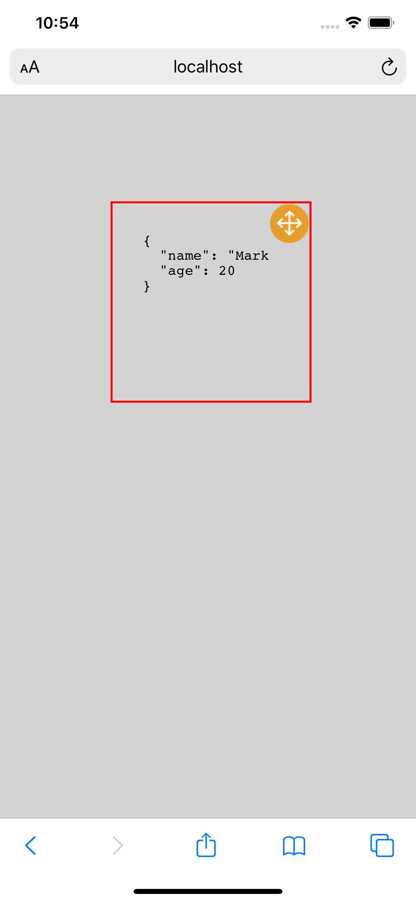

# web-debug-box
A draggable float window for dev to debug (especially for mobile)

Sometimes you need to show html on your mobile, and you want to see the runtime JavaScript variable.
This box will help you to show the data.

#### usage
* install
    * `yarn add web-debug-box`
    * OR `npm install web-debug-box`
* init
    ```
        import WebDebugBox from 'web-debug-box'
        // after the body loaded
        WebDebugBox.init()
    ```
* show data on the `box` to debug
    ```
        const data = {
            name: 'Mark',
            age: 20
        }
        WebDebugBox.showData(data)
    ```
DONE !
---
  
##### Set Style
you can also set style or set class for the `box`

    ```
        // set style
        WebDebugBox.setStyle({
          'width': '90vw',
          'height': '50vh',
          'left': '20px'
        })
        // set class
        WebDebugBox.setClass('class1 class2 ...')
    ```
  Note that this box has a `absolute` position to the `body` of html
  
#### Draggable
    You can drag the box to the suitable place during debugging

#### Example



